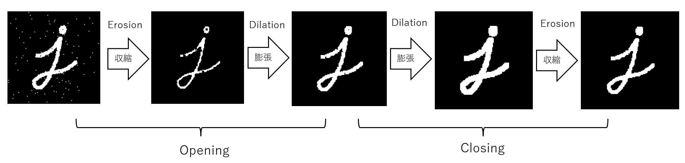

# Tang Primer 25k + USB3.0 基板(RTCL-TP25K-USB3)用 モルフォロジー変換サンプル

## 概要

RTCL-TP25K-USB3 にて、USB3.0 経由で PC から二値画像データを FPGA に送り込み、膨張/収縮処理によるオープニングとクロージングを行ってノイズ除去を行うサンプルです。

モルフォロジー変換については[こちら](https://labs.eecs.tottori-u.ac.jp/sd/Member/oyamada/OpenCV/html/py_tutorials/py_imgproc/py_morphological_ops/py_morphological_ops.html)のサイトを参考にさせて頂きました。

本サンプルでは、`jelly3_img_morphology_filter` を用いて膨張(Dilation)・収縮(Erosion)などのフィルタ処理を実施し、結果画像を `result.bin` として書き出します。



ソフトウェア側では Rust から FT601 を制御し、AXI4-Lite で各種パラメータを設定し、AXI4-Stream で画像データを転送します。FPGA 側は `image_processing` モジュールを通して、画像形式からマトリクス形式への変換、フィルタ処理、再び AXI4-Stream への変換を行います。


## 環境構築

[こちら](../README.md)を参考にしてください。

本プロジェクトでも FT601 は 2チャンネルモードで使用する構成になっています。

## 本プロジェクトの使い方

### gitリポジトリ取得

```bash
git clone https://github.com/ryuz/rtcl-designs.git --recurse-submodules
```

で一式取得してください。

### PC側の GOWIN EDA で fs ファイルを作る

#### TCL ビルド (推奨)

`gw_sh` が利用できる環境設定が出来ている前提で、以下を実行します。

```bash
cd projects/rtcl_tp25k_usb3/rtcl_tp25k_usb3_calc_morphology/syn/cli
make
```

これにより `impl/pnr/rtcl_tp25k_usb3_calc_morphology.fs` が生成されます。

このファイルを JTAG 経由で FPGA にダウンロードできます。コマンドラインで行う場合は、JTAG ケーブルの環境によって実行方法が変わるため、Makefile の `load` や `rom_write` の項を参考にオプションを調整してください。

#### GUI 版

`projects/rtcl_tp25k_usb3/rtcl_tp25k_usb3_calc_morphology/syn/Gowin_V1.9.12.02_SP2` の下にも GUI 用のプロジェクトがあるため、そちらを開いてビルドすることも可能です。

### PC 側のソフト

PC 側では Rust で書かれたサンプルアプリを使って、入力画像の読み込み、FPGA への転送、処理結果の受信と保存を行います。

```bash
cd projects/rtcl_tp25k_usb3/rtcl_tp25k_usb3_calc_morphology/app/rust

# img_128x128.pgm をタイル状に並べて 4kx4k の画像を作る
python3 tile_image.py

# FPGA に転送して処理結果を受信し、result_4096x4096.pgm として保存
cargo run --release

# 受信したバイナリを PGM 形式に変換
python3 bin2pgm.py result.bin resutl_4096x4096.pgm 4096 4096
```

なお Python では OpenCV などを利用していますので、Python 環境に OpenCV がインストールされている必要があります。


[PGM形式](https://ja.wikipedia.org/wiki/PNM_(%E7%94%BB%E5%83%8F%E3%83%95%E3%82%A9%E3%83%BC%E3%83%9E%E3%83%83%E3%83%88)の画像は、[GIMP](https://www.gimp.org/) や [IrfanView](https://www.irfanview.com/) や [ImageMagick](https://imagemagick.org/) などで開くことができる形式です。

このアプリは以下の処理を行います。

1. FT601 デバイスを開く
2. `CORE_ID` / `CORE_VERSION` 等のレジスタを読み出して確認
3. システム制御レジスタに画像幅・高さを設定
4. 形態学フィルタの各種パラメータを設定
5. `input_4096x4096.bin` を読んで、AXI4-Stream で FPGA に送信
6. 処理結果を受信して `result.bin` として出力

### 入力画像について

このサンプルでは 4096x4096 の画像を扱う例になっています。

```text
input_4096x4096.bin
```

というファイル名を想定しており、`main.rs` では以下の設定を行っています。

- `width = 4096`
- `height = 4096`
- `line_bytes = width / 8`

画像データはバイト列として読み込み、`send_frame` で FPGAへ転送されます。結果は `recv_frame` で受信し、`result.bin` に保存されます。


## FPGA 側の構成

本プロジェクトの FPGA は、主に以下の構成で動作します。

- FT601 に接続された USB3.0 FIFO インターフェース
- チャネル 0: AXI4-Lite 制御チャネル
- チャネル 1: AXI4-Stream データチャネル
- `jelly3_system_control` による制御レジスタ
- `image_processing` による画像変換と形態学変換
- `jelly3_img_morphology_filter` によるフィルタ処理

`image_processing.sv` では以下の流れを実装しています。

1. AXI4-Stream から画像を受信
2. `jelly3_axi4s_mat` で AXI4-Stream と画像インターフェースに変換
3. `jelly3_img_morphology_filter` でモルフォロジー処理
4. 処理後の画像を AXI4-Stream で返す

設定例として、アプリ側では以下のようなレジスタを書き込んでいます。

- `CONTROL0`: width
- `CONTROL1`: height
- `MORPHO_PARAM_ENABLE`: 0b11111111
- `MORPHO_PARAM_DILATION`: 0b00111100
- `MORPHO_CTL_CONTROL`: 0b11

上記により、画像のサイズとフィルタの動作条件を FPGA 側へ反映しています。

## 期待される動作

本サンプルでは、USB3.0 で画像を送って処理結果を返すデモを想定しています。

実行すると、以下のようなログが出力されることを想定しています。

```text
Tang Ptimer25k Calc Morphology
SYSCTL_CORE_ID        : 0x....
MORPHO_CORE_ID        : 0x....
MORPHO_CORE_VERSION   : 0x....
Loading input image...
Start
Processing time: ... microseconds
Writing output image...
Output image written: ... bytes
End Test
```

処理後の画像は `result.bin` に保存され、後続の画像解析や可視化に利用できます。


## PC での CPU 処理の参考

PC での CPU 処理の参考として

```bash
python3 morph_open_close.py -i img_4096x4096.pgm
```

で、CPU 側でのオープニングとクロージング処理を行って処理時間を比較することができます。


## 参考資料

- [RTCL-TP25K-USB3 関連プロジェクト](../README.md)
- [rtcl_tp25k_usb3_mipi_lane2](../rtcl_tp25k_usb3_mipi_lane2/README.md)
- [rtcl_tp25k_usb3_calc_summation](../rtcl_tp25k_usb3_calc_summation/README.md)
- [jelly](../../../jelly/README.md)

## 補足

このサンプルは「USB3.0 で画像を FPGA に送り込み、画像処理結果を戻す」最小構成の例として作られています。実際には画像サイズやフィルタ条件を変更することで、より大きな画像や異なるモルフォロジー処理のパラメータに拡張できます。

また、`MORPHO_PARAM_ENABLE` や `MORPHO_PARAM_DILATION` といったレジスタ設定は、対象の画像処理の種類や処理強度に応じて調整してください。
