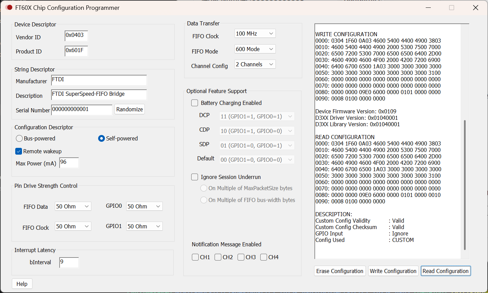

# Tang Primer 25k + USB3.0 基板(RTCL-TP25K-USB3)用 MIPI-CSI2 2レーンカメラキャプチャサンプル

## 概要

RTCL-TP25K-USB3 にて、Raspberry Pi カメラモジュールV2(Sony IMX219)と[グローバルシャッターMIPI高速度カメラ](https://rtc-lab.com/products/rtcl-cam-p3s7-mipi/)を MIPI-CSI2 2レーンで接続し、USB3.0 経由で PC に画像を転送するサンプルです。


## 環境構築

[こちら](../README.md)を参考にしてください。

また FT601 については 2チャンネルのモードを使うようにしています。




## 本プロジェクトの使い方

### gitリポジトリ取得

```bash
git clone https://github.com/ryuz/rtcl-designs.git --recurse-submodules
```

で一式取得してください。


### PC側の GOWIN EDA で fs ファイルを作る

#### TCL ビルド (推奨)

gw_sh が利用できる環境設定が出来ている前提で

```bash
cd projects/rtcl_tp25k_usb3/rtcl_tp25k_usb3_mipi_lane2/syn/cli
make
```

で、`impl/rtcl_tp25k_usb3_mipi_lane2.fs` が生成されます。

このファイルを JTAG 経由で FPGA にダウンロードしますが、コマンドラインで行う場合は JTAG ケーブルの環境によってやり方が変わってきますので Makefile の run や rom_write などの項を参考にオプションを調整ください。


#### GUI 版

`projects/rtcl_tp25k_usb3/rtcl_tp25k_usb3_mipi_lane2/syn/Gowin_V1.9.12.02_SP2` の方に GUI 用のプロジェクトもありますので、そちらを開いてビルドすることも可能です。


### PC 側のソフト

### Raspberry Pi カメラモジュールV2(Sony IMX219)接続時

MIPIコネクタに Raspberry Pi カメラモジュールV2(Sony IMX219)を 15pin-22pin 変換ケーブルで接続し、Tang Primer 25k にFPGA 側のプログラムを書きこんだ後、PC側で下記のコマンドを実行すると、USB3.0経由で画像が転送され、表示されます。

```bash
cd projects/rtcl_tp25k_usb3/rtcl_tp25k_usb3_mipi_lane2/pc/app/imx219
cargo run
```

### グローバルシャッターMIPI高速度カメラ(RTCL-P3S7-MIPI)接続時

グローバルシャッターMIPI高速度カメラ(RTCL-P3S7-MIPI)を、ラズパイ用などの 15pin-22pin 変換ケーブルで接続することができます。

書きこんだ後、PC側で下記のコマンドを実行すると、USB3.0経由で画像が転送され表示されます。

```bash
cd projects/rtcl_tp25k_usb3/rtcl_tp25k_usb3_mipi_lane2/pc/app/p3s7
cargo run
```
